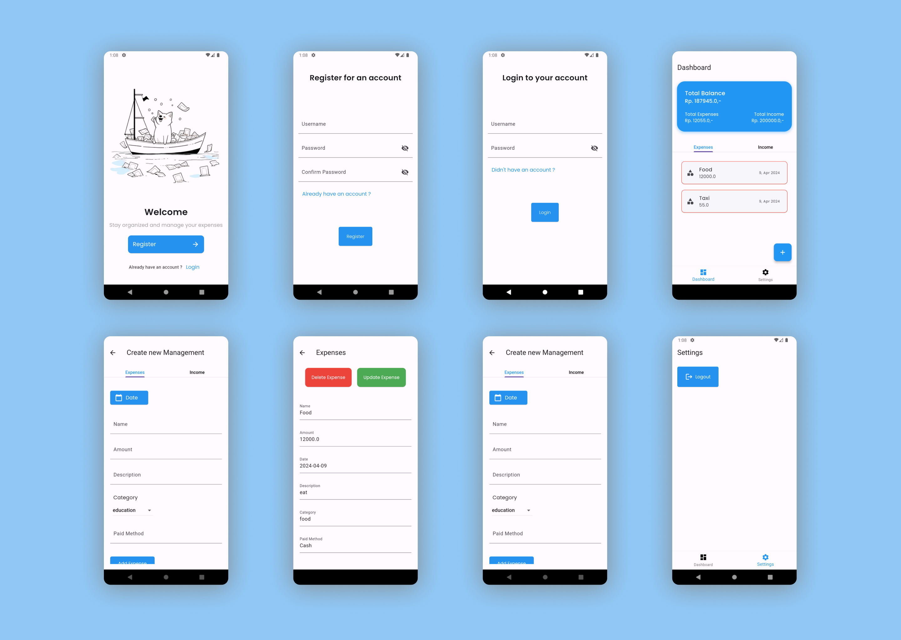

# wealthwatcher

1. [Introduction](#introduction)
2. [Usage](#usage)
3. [Setting up Firebase](#setting-up-firebase)
4. [Firestore Configuration](#firestore-configuration)
5. [About Flutter](#about-flutter)

## Introduction 

This is a mobile app for managing expenses and incomes, built using Flutter. `Firebase` is used for authentication, `Firestore` for the database, and `BLoC` for state management.



## Usage

1. Clone this repository to your local machine.
2. Ensure you have Flutter installed. If not, follow the installation instructions in the [Flutter documentation](https://flutter.dev/docs/get-started/install).
3. Navigate to the project directory in your terminal.
4. Configure firebase 
5. Run the command `flutter run` to launch the app on your emulator or connected device.

## Setting up Firebase

To set up this mobile app, you will need Firebase options for configuring Firebase. You can use this template and store it at 'wealthwatcher/lib/firebase_options.dart'. 

***Template for firebase_options.dart***
```dart
// File generated by FlutterFire CLI.
// ignore_for_file: lines_longer_than_80_chars, avoid_classes_with_only_static_members
import 'package:firebase_core/firebase_core.dart' show FirebaseOptions;
import 'package:flutter/foundation.dart'
    show defaultTargetPlatform, kIsWeb, TargetPlatform;

/// Default [FirebaseOptions] for use with your Firebase apps.
///
/// Example:
/// ```dart
/// import 'firebase_options.dart';
/// // ...
/// await Firebase.initializeApp(
///   options: DefaultFirebaseOptions.currentPlatform,
/// );
/// ```
class DefaultFirebaseOptions {
  static FirebaseOptions get currentPlatform {
    if (kIsWeb) {
      return web;
    }
    switch (defaultTargetPlatform) {
      case TargetPlatform.android:
        return android;
      case TargetPlatform.iOS:
        return ios;
      case TargetPlatform.macOS:
        throw UnsupportedError(
          'DefaultFirebaseOptions have not been configured for macos - '
          'you can reconfigure this by running the FlutterFire CLI again.',
        );
      case TargetPlatform.windows:
        throw UnsupportedError(
          'DefaultFirebaseOptions have not been configured for windows - '
          'you can reconfigure this by running the FlutterFire CLI again.',
        );
      case TargetPlatform.linux:
        throw UnsupportedError(
          'DefaultFirebaseOptions have not been configured for linux - '
          'you can reconfigure this by running the FlutterFire CLI again.',
        );
      default:
        throw UnsupportedError(
          'DefaultFirebaseOptions are not supported for this platform.',
        );
    }
  }

  static const FirebaseOptions web = FirebaseOptions(
    apiKey: '',
    appId: '',
    messagingSenderId: '',
    authDomain: '',
    storageBucket: '',
    measurementId: '',
  );

  static const FirebaseOptions android = FirebaseOptions(
    apiKey: '',
    appId: '',
    messagingSenderId: '',
    storageBucket: '',
  );

  static const FirebaseOptions ios = FirebaseOptions(
    apiKey: '',
    appId: '',
    messagingSenderId: '',
    storageBucket: '',
    iosBundleId: '',
  );
}
```

## Firestore Configuration

Configure these rules in your Firestore.

```
service cloud.firestore {
  match /databases/{database}/documents {
    // Allow only authenticated users to read and write their own user data
    match /users/{userId} {
      allow read, write, delete: if request.auth != null && request.auth.uid == userId;
    }

    // Allow only authenticated users to read and write their own expenses and incomes
    match /users/{userId}/expenses/{document=**} {
      allow read, write, delete: if request.auth != null && request.auth.uid == userId;
    }
    match /users/{userId}/incomes/{document=**} {
      allow read, write, delete: if request.auth != null && request.auth.uid == userId;
    }
  }
}
```

## About Flutter

If this is your first time working with Flutter, here are some resources to help you get started:

- [Lab: Write your first Flutter app](https://flutter.dev/docs/get-started/codelab)
- [Cookbook: Useful Flutter samples](https://flutter.dev/docs/cookbook)

For more help with Flutter development, refer to the [online documentation](https://flutter.dev/docs/), which includes tutorials, samples, and a full API reference.
